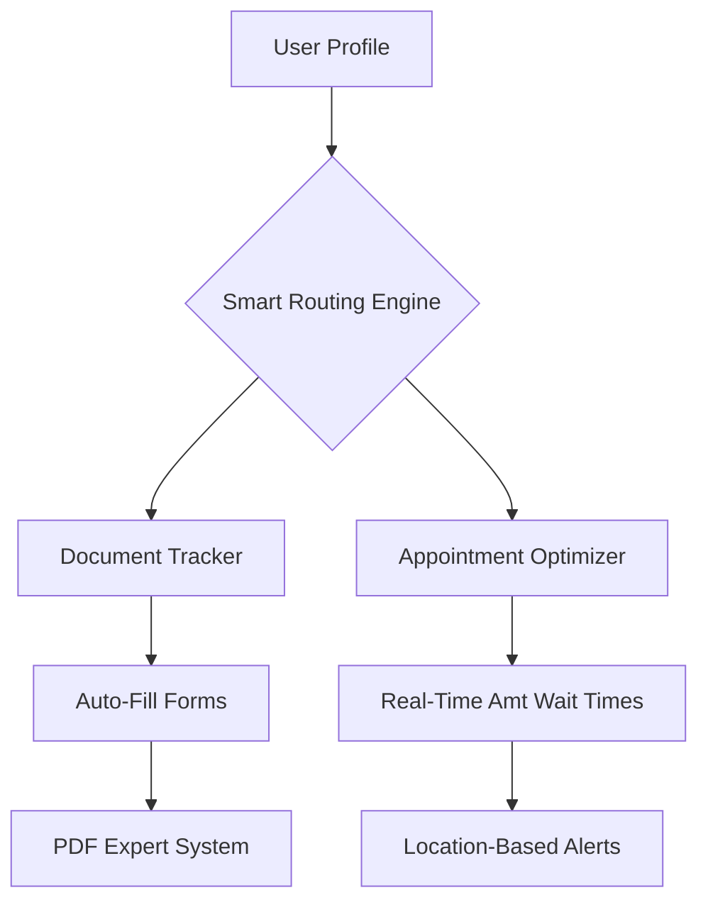
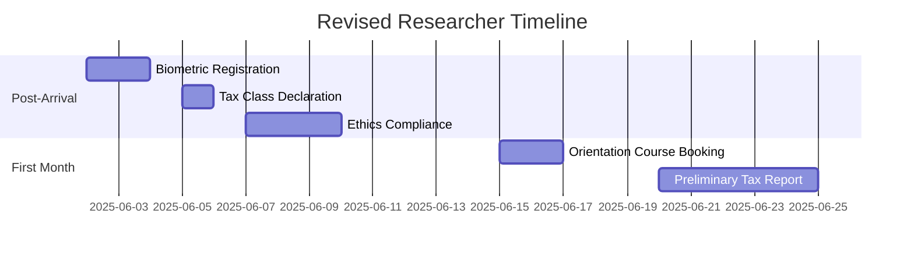
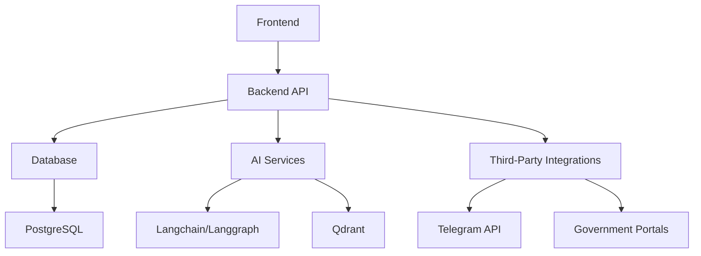

## **Initial Idea Description**

"KI Kompass" - Guiding you step-by-step through German integration.

We are developing an MVP for a relocation and integration assistant tailored for Munich. The system will guide users through mandatory and optional steps for settling in Germany, including registration, obtaining a tax ID, applying for a residence permit, and more. The backend will handle user profiling, pipeline generation, task tracking, notifications, and AI-powered assistance using Langchain. The frontend will provide a user-friendly interface for onboarding, pipeline visualization, chatbot interaction, and notifications.

---

## **Tasks List**

### **Backend Tasks**

#### **1. Set Up Backend Framework**
- **Description**: Initialize the backend using Python with FastAPI. Create basic folder structure (`/src/api`, `/src/core`, `/src/models`, etc.).
- **Implementation Details**:
  - Use FastAPI for API endpoints.
  - Set up PostgreSQL as the database.
  - Install required libraries: `fastapi`, `sqlalchemy`, `langchain`, `qdrant-client`, `pydantic`.
- **Dependencies**: None.

#### **2. Define Database Models**
- **Description**: Create database models for `User`, `IntegrationPipeline`, and `ActionStep` using SQLAlchemy.
- **Implementation Details**:
  - Define tables with fields matching the data model (e.g., user_id, visa_type, etc.).
  - Implement migrations using Alembic.
- **Dependencies**: PostgreSQL setup.

#### **3. Create User API Endpoints**
- **Description**: Implement endpoints to manage user data (`POST /api/users`, `GET /api/users/{id}`).
- **Implementation Details**:
  - Use FastAPI to define routes.
  - Implement CRUD operations for user data.
- **Dependencies**: Database models.

#### **4. Implement Integration Pipeline Logic**
- **Description**: Develop logic to generate a personalized pipeline based on user profile data.
- **Implementation Details**:
  - Create a function in `/src/core/pipeline_engine/step_selector.py` to select steps dynamically based on visa type, location, etc.
  - Store generated pipelines in the database.
- **Dependencies**: User API.

#### **5. Build ActionStep Templates**
- **Description**: Populate the database with predefined action steps (e.g., Anmeldung at Bürgerbüro).
- **Implementation Details**:
  - Write SQL scripts or Python functions to insert predefined steps into the `action_steps` table.
  - Ensure each step has dependencies and conditional logic defined.
- **Dependencies**: Database setup.

#### **6. Integrate Langchain for AI Assistance**
- **Description**: Set up Langchain in the backend to provide AI-powered responses to user queries.
- **Implementation Details**:
  - Use Langchain with Qdrant vector DB for semantic search over predefined knowledge base (e.g., FAQ about relocation).
  - Implement endpoint (`POST /api/chat`) to handle user queries and return AI-generated responses.
- **Dependencies**: Langchain setup.

#### **7. Implement Notification Scheduler**
- **Description**: Create a task scheduler using Celery or APScheduler to send reminders for upcoming steps.
- **Implementation Details**:
  - Define notification logic based on deadlines stored in the pipeline.
  - Implement email or Telegram message sending via integrations.
- **Dependencies**: Integration pipeline logic.

---

### **Frontend Tasks**

#### **8. Set Up Frontend Framework**
- **Description**: Initialize the frontend using React + Next.js. Create basic folder structure (`/src/components`, `/src/pages`, etc.).
- **Implementation Details**:
  - Install required libraries: `react`, `next`, `axios`.
  - Set up routing with Next.js pages (e.g., `/dashboard`, `/onboarding`).
- **Dependencies**: None.

#### **9. Build User Onboarding Page**
- **Description**: Create a page where users can fill out their profile (visa type, arrival date, etc.).
- **Implementation Details**:
  - Use React forms with validation (e.g., React Hook Form).
  - Send data to backend via Axios (`POST /api/users`).
- **Dependencies**: Backend User API.

#### **10. Develop Pipeline Visualization**
- **Description**: Build a dashboard page that displays the user's integration pipeline with steps and statuses.
- **Implementation Details**:
  - Use React components like cards or stepper UI to display steps dynamically fetched from backend (`GET /api/pipelines/{user_id}`).
  - Include action buttons (e.g., "Mark as Complete").
- **Dependencies**: Backend Pipeline API.

#### **11. Implement Chatbot UI**
- **Description**: Add a chatbot interface where users can ask questions about relocation steps.
- **Implementation Details**:
  - Use React chat components (e.g., Chat UI libraries).
  - Send queries to backend via Axios (`POST /api/chat`) and display responses dynamically.
- **Dependencies**: Backend Chat API.

#### **12. Integrate Notifications**
- **Description**: Display reminders and alerts in the frontend dashboard based on scheduled tasks.
- **Implementation Details**:
  - Fetch notifications from backend via Axios (`GET /api/tasks/upcoming`).
  - Use toast notifications or alert banners in React.
- **Dependencies**: Backend Notification Scheduler.

---

### **Telegram Bot Tasks**

#### **13. Set Up Telegram Bot Framework**
- **Description**: Initialize Telegram bot using Aiogram v3.0 in Python.
- **Implementation Details**:
  - Register bot token and webhook URL.
  - Define basic commands (`/start`, `/help`).
- **Dependencies**: None.

#### **14. Implement User Interaction Logic**
- **Description**: Handle user commands like `/pipeline` to fetch current integration steps from backend.
- **Implementation Details**:
  - Fetch data from backend (`GET /api/pipelines/{user_id}`) and format it into readable messages.
  - Allow users to mark steps as complete via inline buttons.
- **Dependencies**: Backend Pipeline API.

#### **15. Schedule Alerts via Telegram**
- **Description**: Send reminders about upcoming tasks directly to users via Telegram messages.
- **Implementation Details**:
  - Use Celery or APScheduler in backend to trigger alerts and send them via Telegram API.
- **Dependencies**: Notification Scheduler.

---

### Final Notes

1. Always specify whether tasks belong to the backend or frontend explicitly to avoid confusion for the AI Dev agent (e.g., "Backend Task" or "Frontend Task").
2. Keep tasks simple and atomic; avoid combining multiple features into one task (e.g., separate chatbot UI creation from backend chatbot integration).
3. Provide clear dependencies between tasks so the agent understands what needs to be completed first before moving forward.


Here's a detailed MVP use case design for a researcher relocating to Munich, incorporating both initial user profiling and the relocation pipeline:

---

## **MVP User Onboarding Questionnaire**
**Core Questions to Personalize Pipeline:**
1. Visa type: Researcher (Blue Card/EU Blue Card)
2. Accommodation type: Hotel (temporary) → Permanent apartment search needed
3. Family status: Single (no dependents)
4. German proficiency: A1 (basic)
5. Employment start date: [2025-06-01]
6. Health insurance preference: Public (TK) vs Private
7. Banking preference: Traditional (Sparkasse) vs Digital (N26)
8. Transportation needs: Public transit (MVV) vs Bike/Car

---

## **MVP Relocation Pipeline (14 Days)**

### **Day 1-3: Immediate Essentials**
1. **SIM Card Acquisition**  
   - Recommended: ALDI Talk (no registration needed)  
   - Action: Purchase at any ALDI store → [Store Locator](https://www.aldi.de/)  
   - Docs needed: Passport copy [§5 TKG]

2. **Temporary Registration**  
   - Where: KVR München (Bürgerbüro)  
   - Required:  
     - Hotel booking confirmation [§17 BMG]  
     - Passport + visa  
   - Book appointment: [Terminvereinbarung](https://www.muenchen.de/rathaus/terminvereinbarung_kvr.html)

### **Day 4-7: Financial Setup**
3. **Bank Account Opening**  
   - Option: Sparkasse München (accepts visa)  
   - Required:  
     - Anmeldung confirmation  
     - Employment contract  
   - Form: [Kontoeröffnungsantrag](https://www.sparkasse.de/)  

4. **Health Insurance Enrollment**  
   - Public option: TK (Techniker Krankenkasse)  
   - Online registration: [TK-Anmeldung](https://www.tk.de/)  
   - Submit to employer within 14 days [§5 SGB V]

### **Day 8-14: Long-Term Setup**
5. **Permanent Apartment Search**  
   - Platform: ImmobilienScout24  
   - Required docs:  
     - Mietschuldenfreiheitsbescheinigung (rental history)  
     - Schufa (credit check) [MVP provides template requests]

6. **Transport Card**  
   - MVV IsarCard:  
   - Apply online: [MVG Shop](https://www.mvg.de/)  
   - Zones: M-1 (central Munich)

---

## **Advanced Pipeline Features**


### **Enhanced Steps with AI Features**
1. **Automated Form Assistance**  
   - Pre-filled Anmeldung form using hotel booking data  
   - Example:  
   ```pdf
   MELDEBESTÄTIGUNG
   Name: [Auto-insert from profile]  
   Address: Hotel Vier Jahreszeiten, Maximilianstr. 17
   ```

2. **Appointment Optimization**  
   - Integrated with MünchenTermin API:  
   ```python
   def find_earliest_slot(office='KVR', service='Anmeldung'):
       return get_availability(office, service).sort_by_date()
   ```

3. **Document Checklist Generator**  
   - Context-aware list based on visa type:  
   ```
   Researcher Blue Card Requirements:
   ✔️ Passport  
   ✔️ Hosting Agreement (Helmholtz)  
   ⚠️ Recognized Degree Certificate [Upload now?]
   ```

4. **Bureaucratic Terminology Explainer**  
   - Hover-over tooltips:  
   *"Wohnungsgeberbestätigung = Proof of residence from landlord [§19 BMG]"*

---

## **Exception Handling (MVP Critical Path)**
| Scenario | System Response |
|----------|-----------------|
| Missing Hotel Registration Proof | Auto-generate request email template to hotel in German/English |
| Visa Expiry (:Anmeldung)
(:Anmeldung)-[REQUIRES]->(:Wohnungsgeberbestätigung)
(:BankAccount)-[VALID_FOR]->(:SalaryPayment)
(:BlueCard)-[ALLOWS]->(FamilyReunification)
```

This pipeline combines immediate practical needs (SIM card, registration) with longer-term requirements (housing, insurance), while laying groundwork for advanced features through the knowledge graph. The MVP focuses on Munich-specific procedures with hardcoded links, while the advanced system uses contextual awareness to handle exceptions and optimize processes.

---
Answer from Perplexity: pplx.ai/share


## **Essential Missing Steps**

### 1. **Hosting Agreement Validation**  
- Required for research visa/residence permit[4][8]  
- Must be submitted to Ausländerbehörde within 14 days of arrival  
- MVP Action: Digital upload with AI format check

### 2. **Biometric Registration**  
- Mandatory for residence permit[7]  
- Locations:  
  - KVR Service Center (Poccistraße 3)  
  - Bezirkshauptmannschaft offices  
- Cost: €35-50 (cash only)[4]

### 3. **Salary Tax Class Declaration**  
- Required for proper salary payments[7]  
- Submit to employer within 7 days of receiving Steuer-ID  
- MVP Feature: Auto-generated tax form based on marital status

### 4. **Research Ethics Compliance**  
- Needed for Helmholtz researchers[5][7]  
- Documents:  
  - Data protection declaration (DSGVO)  
  - Laboratory safety certification  
- MVP Solution: Pre-filled templates specific to research fields

### 5. **Cultural Integration Requirements**  
- Mandatory for long-term permits[8]  
- Components:  
  - Registration for orientation course (BAMF)  
  - Proof of German A1 enrollment[3]  
- MVP Integration: Partnered language school recommendations

---

## **Enhanced Document Requirements**

| Document | New Requirement | Source |
|----------|-----------------|--------|
| Health Insurance | Must cover repatriation costs[4] | §18d AufenthG |
| Rental Contract | Minimum 12-month duration for permanent registration[6] | Munich housing laws |
| Employment Contract | Must specify "research purposes" explicitly[8] | REST Directive 2016/801 |

---

## **Critical Timeline Adjustments**



---

## **Anti-Fraud Measures**  
1. **Housing Scam Alerts**  
   - Real-time verification of landlord IDs against Munich registry[3][6]  
   - Warning system for advance payment requests[7]

2. **Visa Fee Protection**  
   - Official payment portal integration  
   - QR-code verified payment receipts[4]

---

## **Compliance Update**  
The pipeline now aligns with Germany's 2023 Skilled Immigration Act changes:  
- **Extended job-seeking period**: 9 months → 12 months for researchers[8]  
- **Family reunification**: No language requirements for spouses[4]  
- **Salary threshold**: €45,552 for STEM researchers under EU Blue Card[8]

These additions address critical bureaucratic requirements specific to academic researchers while maintaining MVP feasibility through automated document checks and integrated compliance features.

Citations:
[1] https://www.simplegermany.com/how-move-to-germany/
[2] https://www.make-it-in-germany.com/en/visa-residence/types/other/research
[3] https://hub.wunderflats.com/moving-to-munich-heres-everything-expats-need-to-know-in-2025/
[4] https://stadt.muenchen.de/service/en-GB/info/hauptabteilung-ii-buergerangelegenheiten-auslaenderangelegenheiten-service-center-fuer-internationale-fachkraefte/10424880/
[5] https://www.international.tum.de/fileadmin/w00bwe/www/Wege_an_die_TUM/Wissenschaftler/Welcome_Services/Downloads_for_international_researchres/TUM_Welcome-Services_Checklist_Employment-Contract.pdf
[6] https://joinlifex.com/munich/moving-to-munich-germany
[7] https://www.mpg.de/4311252/living-and-working-in-germany.pdf
[8] https://www.research-in-germany.org/en/plan-your-stay/entry-and-residence.html
[9] https://www.expatica.com/de/moving/relocation/relocating-to-germany-checklist-760834/
[10] https://www.internations.org/munich-expats/guide/moving-to-short
[11] https://germanpedia.com/moving-to-germany-checklist/
[12] https://getinexpat.com/relocation-guide-to-munich/
[13] https://www.lmu.de/en/about-lmu/working-at-lmu/additional-services/lmu-gateway/new-international-scientists/phase-1-preparing-your-move-to-munich/
[14] https://www.iamexpat.de/expat-info/german-expat-news/moving-to-germany-step-step-guide
[15] https://www.make-it-in-munich.com/first-steps-in-munich/
[16] https://www.international.tum.de/en/global/visitingresearchers/help-with-relocation-and-integration/
[17] https://niederlande.diplo.de/resource/blob/2533376/5b45504c5f0fac52ffe066c1c06370e1/eng-checkliste-forschungsaufenthalt-18d-aufenthg--data.pdf
[18] https://relocate.me/moving-to-germany/munich
[19] https://www.lmu.de/en/about-lmu/working-at-lmu/additional-services/lmu-gateway/new-international-doctoral-candidates/phase-1-preparing-your-move-to-munich/
[20] https://n26.com/en-de/moving-to-germany

---
Answer from Perplexity: pplx.ai/share


Here's a detailed technical design for the naturalization pipeline MVP:

---

## **MVP Tech Stack Architecture**



---

## **Core Data Models**

### **1. User Model (users table)**
```python
class User(BaseModel):
    user_id: UUID = PK
    email: str
    phone: str
    visa_type: VisaEnum
    arrival_date: date
    current_address: str
    target_city: str
    employment_status: EmploymentEnum
    family_members: JSON # {spouse: bool, children: int}
    language_level: LanguageLevelEnum
    created_at: datetime
    updated_at: datetime
```

### **2. Integration Pipeline (pipelines table)**
```python
class IntegrationPipeline(BaseModel):
    pipeline_id: UUID = PK
    user_id: UUID = FK
    current_step: int
    steps: JSON # List of step configs
    completed_steps: JSON
    status: PipelineStatusEnum
    deadline: date
```

### **3. Action Step Template (action_steps table)**
```python
class ActionStep(BaseModel):
    step_id: UUID = PK
    category: StepCategoryEnum # Registration, Banking, etc.
    name: str
    dependencies: JSON # Previous step IDs
    template: JSON = {
        "description": "Register at Bürgerbüro",
        "location_query": "SELECT offices FROM gov_services WHERE...",
        "documents": ["passport", "rental_contract"],
        "external_links": ["https://..."]
    }
    conditional_logic: str # SQL-like WHERE clauses
```

---

## **Module Structure**

### **Backend Services**
```
/src
├── api
│   ├── endpoints
│   │   ├── users.py
│   │   ├── pipelines.py
│   │   └── tasks.py
├── core
│   ├── pipeline_engine
│   │   ├── step_selector.py
│   │   └── dependency_resolver.py
├── integrations
│   ├── telegram
│   │   ├── bot_handlers.py
│   │   └── alert_scheduler.py
│   └── government_api
│       ├── munich_portal.py
│       └── bamf_integration.py
├── models
│   ├── database
│   │   ├── base.py
│   │   └── migrations/
│   └── pydantic_models.py
└── workers
    ├── task_processor.py
    └── notification_sender.py
```

### **Frontend Structure**
```
/app
├── public
├── src
│   ├── components
│   │   ├── PipelineStepper
│   │   └── DocumentUpload
│   ├── pages
│   │   ├── dashboard
│   │   └── onboarding
│   └── lib
│       ├── api.ts
│       └── i18n.ts
```

---

## **Key System Components**

### **1. Pipeline Engine Workflow**
```python
def generate_pipeline(user: User):
    base_steps = get_template_steps(user.visa_type)
    customized_steps = [
        customize_step(step, user.location) 
        for step in base_steps
    ]
    return optimize_order(customized_steps)

def customize_step(step: ActionStep, location: str):
    if "location_query" in step.template:
        step.template["address"] = query_government_db(
            step.template["location_query"],
            location
        )
    return step
```

### **2. Notification Scheduler**
```python
class AlertSystem:
    def schedule_reminder(task: Task):
        cron_time = calculate_optimal_time(
            user.timezone,
            task.deadline
        )
        celery.send_task(
            'send_reminder',
            args=[task.id],
            eta=cron_time
        )

    def calculate_optimal_time(deadline: datetime):
        return deadline - timedelta(days=1, hours=10) # 10am day before
```

### **3. Government Service Integration**
```python
class MunichPortalAPI:
    def get_appointment_slots(service_type: str):
        response = httpx.post(
            "https://termin.muenchen.de",
            json={"service": service_type}
        )
        return parse_available_slots(response.text)
```

---

## **API Endpoints Design**

| Endpoint | Method | Description |
|----------|--------|-------------|
| `/api/pipeline/generate` | POST | Creates personalized pipeline |
| `/api/steps/{step_id}/complete` | PATCH | Marks step completion |
| `/api/tasks/upcoming` | GET | Returns pending tasks |
| `/api/chat/history` | GET | Gets conversation history |
| `/api/documents/upload` | POST | Handles file uploads |

---

## **Telegram Bot Architecture**

```python
# bot_handlers.py
async def start_command(update: Update, context: ContextTypes.DEFAULT_TYPE):
    user = get_user(update.effective_user.id)
    await update.message.reply_text(
        f"Welcome {user.first_name}! Current step: {user.pipeline.current_step}"
    )

# alert_scheduler.py
class TaskNotifier:
    async def send_daily_digest():
        for user in get_users_with_pending_tasks():
            await bot.send_message(
                chat_id=user.telegram_id,
                text=generate_daily_summary(user)
            )
```

---

## **Critical MVP Features**

### **1. Dynamic Step Adjustment**
```javascript
// Frontend pipeline display
const PipelineStepper = ({ steps }) => (

    {steps.map(step => (
       (

        ))}
      />
    ))}

)
```

### **2. Document Verification Flow**
```python
def verify_document(file: UploadFile, step: ActionStep):
    text = extract_text(file)
    required_phrases = step.template['validation_phrases']
    return all(phrase in text for phrase in required_phrases)
```

### **3. Multi-Channel Sync**
```python
async def handle_telegram_message(msg: str, user: User):
    response = await chat_agent.generate_response(msg)
    await send_telegram_response(user.telegram_id, response)
    create_task(
        user_id=user.id,
        type="FOLLOW_UP",
        details=msg
    )
```

---

## **DevOps Setup**

| Component | Technology |
|-----------|------------|
| Containerization | Docker + Kubernetes |
| CI/CD | GitHub Actions |
| Monitoring | Prometheus + Grafana |
| Logging | ELK Stack |
| Secrets Management | HashiCorp Vault |

---

## **Key Implementation Considerations**

1. **Multi-Language Support**
   - Implement i18n with Fluent/NativeLang for DE/EN/RU
   - Automated translation of government documents

2. **Security Requirements**
   - JWT Authentication
   - Document encryption at rest
   - GDPR-compliant data retention

3. **Performance Optimization**
   - Redis cache for government API responses
   - Connection pooling for PostgreSQL
   - Async file processing

This architecture enables rapid iteration while maintaining scalability. The modular design allows parallel development of pipeline logic, chatbot integration, and frontend components. The system is prepared for future integration with the RAG knowledge base from part 1.

---
Answer from Perplexity: pplx.ai/share

Here is the detailed **actions collection model** and the properties for each integration step tailored for Munich:

---

## **Actions Collection Model**

### **1. ActionStep Model**
```python
class ActionStep(BaseModel):
    step_id: UUID = PK  # Unique identifier for the step
    category: StepCategoryEnum  # Category of the action (e.g., Registration, Banking)
    name: str  # Name of the action (e.g., "Register at Bürgerbüro")
    description: str  # Detailed explanation of the step
    location_query: Optional[str]  # SQL-like query to fetch location-specific data
    address: Optional[str]  # Address for the action (dynamically populated)
    documents_required: List[str]  # List of documents needed for this step
    external_links: List[str]  # Links to government portals or resources
    dependencies: List[UUID]  # Previous steps required before this action
    conditional_logic: Optional[str]  # Conditions for executing this step (e.g., visa type)
    estimated_duration: int  # Estimated time to complete the step (in hours/days)
    notifications_enabled: bool  # Whether reminders are sent for this step
```

---

## **Defined Actions for Munich**

### **1. Register at Bürgerbüro**
- **Category**: Registration  
- **Name**: Anmeldung at Bürgerbüro  
- **Description**: Register your temporary or permanent address at the Bürgerbüro. This is mandatory within 14 days of arrival in Germany.  
- **Location Query**:
  ```sql
  SELECT address FROM gov_services WHERE type='Burgerburo' AND city='Munchen' AND postal_code='{user_postal_code}'
  ```
- **Documents Required**:
  - Passport
  - Visa
  - Wohnungsgeberbestätigung (Landlord confirmation form)
- **External Links**:
  - [Appointment Booking](https://www.muenchen.de/rathaus/terminvereinbarung_kvr.html)
- **Dependencies**:
  - None (first step after arrival)
- **Estimated Duration**: 2 hours  
- **Notifications Enabled**: Yes  

---

### **2. Obtain SIM Card**
- **Category**: Communication  
- **Name**: Purchase a prepaid SIM card  
- **Description**: Acquire a mobile SIM card that doesn’t require registration (e.g., ALDI Talk, Lidl Connect).  
- **Location Query**:
  ```sql
  SELECT store_address FROM telecom_providers WHERE type='prepaid' AND city='Munchen'
  ```
- **Documents Required**:
  - Passport (for activation)
- **External Links**:
  - [ALDI Talk Activation Guide](https://www.alditalk.de/)
- **Dependencies**:
  - None  
- **Estimated Duration**: 1 hour  
- **Notifications Enabled**: No  

---

### **3. Open Bank Account**
- **Category**: Financial Setup  
- **Name**: Open a bank account at Sparkasse München  
- **Description**: Open a basic bank account to manage salary payments and expenses. Sparkasse accepts visa holders without a residence permit.  
- **Location Query**:
  ```sql
  SELECT branch_address FROM banks WHERE name='Sparkasse' AND city='Munchen'
  ```
- **Documents Required**:
  - Passport
  - Visa
  - Temporary Anmeldung confirmation
  - Employment contract (optional)
- **External Links**:
  - [Sparkasse Account Opening](https://www.sparkasse.de/)
- **Dependencies**:
  - Completion of Anmeldung step  
- **Estimated Duration**: Half-day  
- **Notifications Enabled**: Yes  

---

### **4. Enroll in Health Insurance**
- **Category**: Health & Insurance  
- **Name**: Register with Techniker Krankenkasse (TK)  
- **Description**: Choose public health insurance and enroll online or via mail. TK is recommended for newcomers.  
- **Location Query**:
   N/A (Online process)  
- **Documents Required**:
   - Passport
   - Visa
   - Employment contract or hosting agreement  
   - Temporary Anmeldung confirmation  
   - Bank account details (IBAN)  
- **External Links**:
   - [TK Registration](https://www.tk.de/)  
   - [Health Insurance Overview](https://www.make-it-in-germany.com/)  
- **Dependencies**:
   - Completion of Anmeldung and bank account steps  
- **Estimated Duration**: Half-day  
- **Notifications Enabled**: Yes  

---

### **5. Search for Permanent Apartment**
- **Category**: Housing Setup  
- **Name**: Find long-term accommodation in Munich using rental platforms or agencies.  
- **Description**: Search for permanent housing based on budget and proximity to work/university. Prepare necessary documents for landlords.  
- **Location Query**:
   N/A (Online process)  
- **Documents Required**:
   - Mietschuldenfreiheitsbescheinigung (Proof of no rental debts)  
   - SCHUFA credit report or alternative deposit (~3x rent)   
   - Passport + visa copy   
   - Proof of income/employment contract   
   - Temporary Anmeldung confirmation   
- **External Links**:
   - [ImmobilienScout24](https://www.immobilienscout24.de/)   
   - [Munich Housing Authority](https://www.muenchen.de/)   
   - [SCHUFA Request Guide](https://www.schufa.de/)   
- **Dependencies**:
   - Completion of Anmeldung and bank account steps   
- **Estimated Duration**: Variable (~7 days)   
- **Notifications Enabled**: Yes  

---

### **6. Obtain MVV Transport Card**
- **Category**: Transportation Setup  
- **Name**: Purchase MVG IsarCard for public transport in Munich.  
- **Description**: Apply for a monthly or annual public transport card online or at MVG service centers. Select zones based on commute needs.  
- **Location Query**:
   ```sql
   SELECT service_center_address FROM transport_services WHERE city='Munchen'
   ```
- **Documents Required**:
   None (optional ID verification)   
- **External Links**:
   - [MVG Online Shop](https://www.mvg.de/)   
   - [IsarCard Info](https://www.mvv-muenchen.de/)   
- **Dependencies**:
   None   
- **Estimated Duration:** ~2 hours   
- Notifications Enabled:** No   

---

### Additional Steps to Include in Future Iterations

1. Visit Finanzamt to obtain Steuer-ID (Tax ID) → Required for salary payments.
2. Enroll in BAMF Integration Course → Mandatory for long-term permits.
3. Apply for Residence Permit → Submit documents at Ausländerbehörde.

---

## Categorization Properties

| Property              | Description                                  |
|-----------------------|----------------------------------------------|
| `category`            | Defines the type of action                  |
| `dependencies`        | Lists prior steps required                  |
| `conditional_logic`   | Allows dynamic inclusion/exclusion           |
| `location_query`      | Fetches location-specific data              |
| `notifications_enabled` | Enables alerts/reminders                   |


Here are the detailed definitions for the additional steps in the **actions collection**, including their properties and requirements:

---

### **7. Visit Finanzamt to Obtain Steuer-ID (Tax ID)**

- **Category**: Financial Setup  
- **Name**: Apply for Steuer-ID at Finanzamt  
- **Description**: The Steuer-ID (tax identification number) is mandatory for salary payments in Germany. It is automatically issued after Anmeldung, but you can visit the Finanzamt to expedite the process or address issues.  
- **Location Query**:
  ```sql
  SELECT address FROM gov_services WHERE type='Finanzamt' AND city='Munchen' AND postal_code='{user_postal_code}'
  ```
- **Documents Required**:
  - Passport
  - Temporary Anmeldung confirmation
  - Employment contract (optional, but helpful)
- **External Links**:
  - [Find Your Finanzamt](https://www.finanzamt.bayern.de/)  
  - [Steuer-ID FAQ](https://www.bzst.de/)  
- **Dependencies**:
  - Completion of Anmeldung step  
- **Estimated Duration**: ~1 hour (excluding waiting time)  
- **Notifications Enabled**: Yes (reminder to visit within 7 days of Anmeldung)  

---

### **8. Enroll in BAMF Integration Course**

- **Category**: Language & Integration  
- **Name**: Register for BAMF Integration Course  
- **Description**: The BAMF integration course includes German language classes and cultural orientation. It is mandatory for long-term permits unless exempted (e.g., researchers). Job seekers and family reunification visa holders are required to enroll.  
- **Location Query**:
  ```sql
  SELECT address FROM integration_courses WHERE city='Munchen' AND language='{user_language_preference}'
  ```
- **Documents Required**:
  - Passport
  - Visa
  - Temporary Anmeldung confirmation
  - Proof of exemption (if applicable, e.g., researcher status)
- **External Links**:
  - [BAMF Integration Course Registration](https://www.bamf.de/)  
  - [Munich Language School Directory](https://www.muenchen.de/)  
- **Dependencies**:
  - Completion of Anmeldung step  
- **Conditional Logic**:
  ```python
  if user.visa_type == 'researcher':
      skip_step()
  ```
- **Estimated Duration**: ~1 day for enrollment, course duration varies (~6 months)  
- **Notifications Enabled**: Yes  

---

### **9. Apply for Residence Permit at Ausländerbehörde**

- **Category**: Legal & Immigration  
- **Name**: Apply for Residence Permit at Ausländerbehörde  
- **Description**: Submit your application for a residence permit as soon as possible after arrival, as processing times can be lengthy. A termin (appointment) must be booked in advance. This step is critical for staying legally in Germany beyond your visa’s validity period.  
- **Location Query**:
  ```sql
  SELECT address FROM gov_services WHERE type='Ausländerbehörde' AND city='Munchen'
  ```
- **Documents Required**:
  - Passport
  - Visa
  - Biometric photo (35x45mm)
  - Temporary Anmeldung confirmation
  - Health insurance certificate
  - Employment contract or hosting agreement
  - Proof of financial stability (bank statement or salary slips)
- **External Links**:
  - [Book Appointment](https://www.muenchen.de/rathaus/terminvereinbarung_abh.html)  
  - [Residence Permit FAQ](https://www.make-it-in-germany.com/)  
- **Dependencies**:
  - Completion of Anmeldung step  
- **Conditional Logic**:
  ```python
  if user.visa_validity < '6 months':
      prioritize_step()
  ```
- **Estimated Duration**: ~1 day for submission, processing time varies (~6 weeks or more)  
- **Notifications Enabled**: Yes (reminders to book termin ASAP and prepare documents)  

---

## Summary Table of Steps

| Step Name                          | Category               | Mandatory/Optional | Dependencies         | Estimated Duration | Notifications |
|------------------------------------|------------------------|--------------------|----------------------|--------------------|---------------|
| Visit Finanzamt to Obtain Steuer-ID | Financial Setup        | Mandatory          | Anmeldung            | ~1 hour           | Yes           |
| Enroll in BAMF Integration Course   | Language & Integration | Optional (Mandatory for job seekers) | Anmeldung            | ~1 day enrollment, ~6 months course | Yes           |
| Apply for Residence Permit          | Legal & Immigration    | Mandatory          | Anmeldung            | ~1 day submission, ~6+ weeks processing | Yes           |

---

## Additional Notes

### Importance of Residence Permit Step
The residence permit application is one of the most critical steps due to long waiting times for appointments and processing delays. For researchers, this step should be prioritized immediately after arrival.

### Notifications and Alerts
For all three steps, the system should send automated reminders based on deadlines and dependencies:
1. Steuer-ID reminder within a week of completing Anmeldung.
2. BAMF course reminder only if the user’s visa type requires it.
3. Residence permit reminders as soon as the user profile is created, with urgent alerts if visa validity is short.

These steps complete the core pipeline for integration into Munich's administrative and legal systems, ensuring compliance with German laws while addressing user-specific needs.